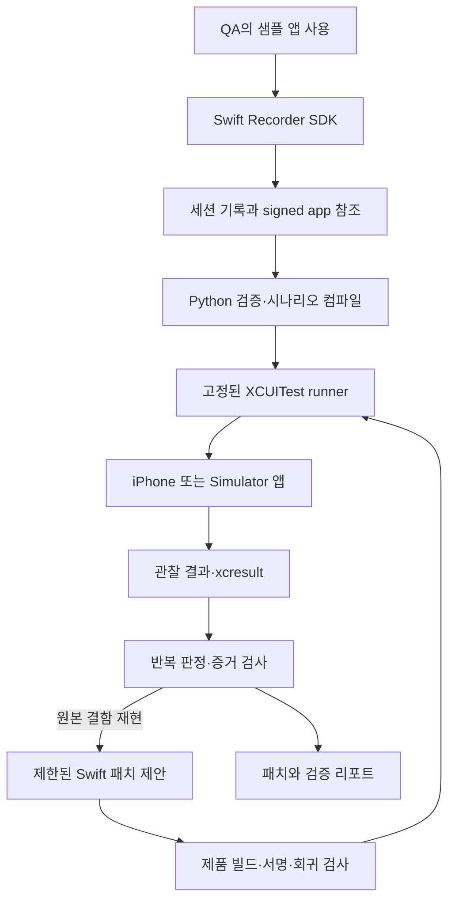

# iOS 지원 설계

이 문서는 iOS 재현/수정 어댑터의 초기 설계입니다. 지속 원격 조작과 팜 운영의 상위 방향은 [플랫폼 아키텍처](PLATFORM-ARCHITECTURE.md)를 따릅니다.

작성일: 2026-09-09 · 상태: Simulator MVP 구현·검증 완료, 실기기 미검증 · 대상: Repro Loop의 다음 플랫폼

구현된 범위와 실행 증거는 [iOS 실행 문서](IOS-RUNBOOK.md)에 정리했다. 아래 설계에는 아직 구현하지 않은 후속 단계도 포함한다.

## 1. 결정과 첫 완료 기준

**Swift 기록 SDK + 보호된 XCUITest 시나리오 실행기 + 기존 Python 호스트**로 시작한다. 앱 설치·파일 회수는 Apple 도구 어댑터가 담당하고, 입력 재생은 XCUITest가 담당한다. 초기에는 시나리오 전체를 한 테스트 세션에서 실행한다. 동작마다 xcodebuild를 다시 시작하거나 범용 원격 REPL 서버를 먼저 만들지 않는다.

첫 대상은 UIKit 기반 카운터 샘플이다. 기록 SDK의 배포 대상은 iOS 16을 설계 기준으로 제안하되, 실기기 자동화의 지원 버전은 Xcode·devicectl·서명 경로별 시험 뒤에 별도로 선언한다. SwiftUI SDK 어댑터는 두 번째 화면 구현으로 동일 계약을 검증한 뒤 지원한다.

완료 기준은 fixture부터 사용한 세션을 기록하여, 원본의 같은 결함을 3회 확인하고 `CounterLogic.swift`의 제한된 수정 후 동일 빌드 구성에서 3회 정상 결과와 보호된 회귀 테스트 통과를 증명하는 것이다. Simulator 검증과 iPhone 실기기 검증은 별도 결과다.

Android 기기 재연결은 이 설계 작업의 전제 조건이 아니다. Android의 남은 검증 상태는 유지하고, 이 단계에서는 Android 동작이나 기존 번들을 변경하지 않는다.

## 2. 현재 저장소에서 재사용할 부분

현재 호스트는 범용 플랫폼 엔진이 아니다. 샘플 패키지·fixture·입력값·APK·CounterLogic 경로를 코드에 고정하고 있으므로, 단순히 `IosDevice`만 추가해서는 동작하지 않는다.

| 현재 위치 | 재사용 또는 분리할 책임 |
|---|---|
| `reproloop/core.py` | 반복 판정·이벤트 순서·서로 다른 실제/기대 조건은 공유. fixture, target, 허용 입력은 플랫폼별 샘플 정책으로 분리 |
| `reproloop/storage.py` | 안전한 JSON·hash·로컬 lease는 공유. PACKAGE와 `original.apk` 고정 구조는 v2 artifact 계약으로 분리 |
| `reproloop/device.py` | ADB 구현은 Android 어댑터로 유지. 공통 인터페이스에 ADB shell을 노출하지 않음 |
| `reproloop/replay.py` | 실행 결과·반복 집계·리포트는 공유. 동작마다 host가 호출하는 구조 외에 batch 실행 결과를 받을 경계 추가 |
| `reproloop/repair.py` | 제한된 교체·보호 경로·명령 예산은 공유. 소스 파일 수집, 빌드 명령, 표현식 검사는 플랫폼별 구현 |
| `reproloop/orchestrator.py` | baseline→patch→build→verify 흐름 공유. Kotlin 파일·Gradle task·APK 경로·JUnit parser 고정값 제거 |
| `reproloop/agents.py` | 도구 없는 패치 제안 방식 공유. iOS의 허용 Swift 파일과 합성 기록만 전달 |

공통 경계는 아래 4개로 제한한다. 구현 시 Protocol 또는 명시적인 함수 계약으로 표현하며 플러그인 검색·전역 registry를 먼저 도입하지 않는다.

- `PlatformPolicy`: 지원 입력·selector·fixture·artifact schema와 패치 허용 범위.
- `BuildAdapter`: source receipt, 제품 빌드, 보호된 회귀 검사, artifact receipt.
- `ReplayAdapter.runScenario`: 준비된 시나리오 한 회의 실행·관찰·정리와 증거 반환.
- `EvidenceValidator`: 플랫폼별 설치/실행 증거를 검증한 뒤 공통 판정에 전달.

## 3. iOS 구성



| 구성 | 역할 |
|---|---|
| `ios/Recorder` Swift package | opt-in UI 계측, 순서·freeze·민감정보 제외, 파일 저장 |
| `ios/Sample` | UIKit 카운터, fixture와 기록 버튼, CounterLogic.swift |
| `ios/ReplayTests` | 보호된 XCTest UI test target, JSON 시나리오 해석·ID 입력·관찰 |
| `ios/LogicTests` | 원래 실패하고 패치 후 통과해야 하는 제품 계약 검사 |
| 호스트 iOS 어댑터 | Xcode 명령, artifact 준비, 결과 파싱, 기기 점유, 정리 |

ReplayTests는 앱 SDK의 내부 비즈니스 함수를 호출해서 재현하지 않는다. 제품의 실제 UI를 거친다. fixture 초기화와 build identity 조회만 보호된 테스트 빌드 계약으로 별도 제공한다.

## 4. Swift 기록 SDK

UIKit의 명시적으로 감싼 버튼·텍스트 필드·목록·화면 이동부터 계측한다. 앱 전체 터치를 후킹하거나 임의 앱 입력을 수집한다고 가정하지 않는다. SDK의 의미 ID와 `accessibilityIdentifier`는 같은 상수에서 정의한다. 녹화용 식별자와 XCUITest에서 실제 조회되는 요소가 일치하는지 첫 단계에서 확인한다.

SwiftUI에서는 후속으로 명시적인 action wrapper, 입력 commit, `.accessibilityIdentifier` 연결을 제공한다. 상태 변경 알림을 모두 사용자 동작으로 간주하지 않는다. 부모/자식 accessibility 요소 병합과 중복 ID는 별도의 수용 사례로 확인한다.

기록 규칙:

- QA가 fixture 준비 후 기록 시작을 선택한다. `startState`와 fixture 입력 digest를 그 세션에 연결한다.
- UI 상태 읽기·의미 이벤트 생성은 MainActor에서 수행한다. sequence 할당과 큐 삽입을 같은 순서 경계에서 처리하고, 파일 I/O는 단일 직렬 writer로 보낸다. 이벤트마다 독립 Task를 생성해 순서가 유지된다고 가정하지 않는다.
- 텍스트는 완료값으로 기록한다. 첫 버전은 빈 문자열·QA·Test 같은 합성 값만 허용한다. secure text field는 수집하지 않는다.
- 입력 완료 후 발생한 다음 동작 앞에 commit을 먼저 기록한다. 프로그램에 의한 렌더링/초기화 변경은 사용자 입력으로 기록하지 않는다.
- Report는 마지막 `endSequence`를 고정한다. writer의 앞선 이벤트 처리가 끝난 뒤 원자적으로 capture와 finalized metadata를 게시한다. Report 자체는 입력 시나리오에 포함하지 않는다.
- 10분·20MB 제한을 적용하고 초과 시 앞부분을 버리지 않는다. 기록을 잘림 상태로 닫아 자동 재현을 차단한다. metadata·JSONL·최종 파일·임시 복사본을 예산에 포함한다.
- 저장 실패·미지원 입력·재생 불가능한 scene 전환은 불완전 상태다. 첫 버전은 background/resume으로 끊긴 기록을 자동으로 이어 붙이지 않는다.
- 크래시 핸들러가 모든 Swift 오류·강제 종료·watchdog 종료를 잡거나 마지막 이벤트를 보장한다고 가정하지 않는다. 복구 JSONL은 진단에 사용할 수 있지만 final marker가 없으면 자동 수정의 근거로 승격하지 않는다.

기본 저장소는 앱 컨테이너 안의 전용 `Library/Application Support/ReproLoop/<sessionId>/`다. 운영 빌드에서는 SDK 기록 기능과 fixture 진입점을 제외한다. 앱 외부 로그·OS 전체 진단·네트워크 본문·스크린샷은 첫 범위에 포함하지 않는다.

## 5. XCUITest의 입력 의미와 실행 방식

| 의미 동작 | 첫 iOS 매핑 | 중단 기준 |
|---|---|---|
| `tap` | accessibilityIdentifier로 유일한 요소 조회, 존재·활성·hittable 확인 후 tap | 요소 없음·중복·가림·비활성 |
| `replace` | 샘플의 명시적인 clear UI와 필드 typeText, 최종 value 확인 | secure field, 지원하지 않는 clear 방식, 값 불일치 |
| `scroll_to` | 지정 scroll container를 방향대로 제한 횟수 swipe하여 target이 hittable인지 확인 | 컨테이너 모호, 진행 없음, 횟수/시간 초과 |
| `navigate_back` | 명시적인 앱 내 back 버튼 ID로 복귀 | back 대상 미노출 또는 예상 화면 미도달 |
| `wait` | 보호된 화면 계약의 요소/상태를 제한 시간 관찰 | 관찰 조건 불명확·timeout |

Android의 전역 Back을 iOS에서도 제공한다고 표현하지 않는다. edge swipe, 시스템 키보드 조작, 긴 누름 선택 메뉴의 언어별 처리는 초기 미지원이다. `replace` 한 이벤트가 clear→typeText 같은 여러 API 호출로 변환될 수 있으나 이 매핑은 고정된 어댑터 규칙이며 receipt에 남긴다. 에이전트가 입력을 새로 발명하는 것과 구분한다.

고정된 `ReproReplayTests/testScenario`가 정제된 시나리오 한 회를 실행한다. 초안은 작은 payload(최대 16KiB)를 `.xctestrun`의 테스트 환경에 인코딩해 전달하는 방식이다. 크기를 초과하면 차단하고, 앱에 대한 launchEnvironment에는 fixture·replay mode·job nonce 같은 최소값만 전달한다. payload를 임의 shell 명령으로 해석하지 않는다.

`.xctestrun`은 설치된 Xcode가 생성한 형식에서 출발해 문서화된 환경·target artifact 경로만 설정한다. 최종 파일 hash도 policy에 고정한다. 버전별 형식을 추측해 수작업으로 만들어내지 않는다. 실제 payload 전달·수신은 I0에서 검증해야 할 가설이다.

XCUITest를 이벤트마다 재실행하지 않는다. 한 테스트 내부에서 모든 동작과 관찰을 수행하고 구조화된 결과를 attachment로 남긴다. 호스트는 원본 N회, 수정본 N회를 각각 별도 run ID와 고유 result bundle로 집계한다. 초기에는 Xcode 자체의 자동 재시도·병렬 테스트 기능을 끄고 호스트가 반복 수를 관리한다.

원래 결함을 관찰했다는 이유로 UI test 전체를 실패시키지 않는다. UI test 성공은 runner가 관찰을 정상 완료했다는 뜻이며, `bugCondition`·`expectedCondition`의 값은 host가 따로 판정한다. 반대로 XCTest 종료 코드 0만으로 `verified`를 선언하지 않는다. runner 테스트 식별자, 실제 실행 수, skip 여부, 필수 attachment·해시를 모두 확인한다.

## 6. 초기화·서명·원본 설치 증거

### 앱 상태 초기화

앱 재실행을 Android의 `pm clear`와 같은 동작으로 보지 않는다. iOS fixture adapter는 테스트 빌드에서 관리하는 파일·UserDefaults 영역·테스트용 Keychain 항목을 명시적으로 초기화하고 확인한다. 재설치만으로 Keychain이나 서버 상태까지 초기화됐다고 가정하지 않는다. 기기의 전체 Keychain·다른 앱·개인 iCloud 데이터에는 접근하지 않는다.

각 run은 terminate→지원 범위의 fixture reset→launch→startState 확인 순서다. 최초 샘플은 iCloud·push·외부 로그인·실제 결제를 사용하지 않는다. 상태 확인 실패는 `environment_blocked`이며 카운터가 0이라는 사실만으로 모든 준비 상태가 맞다고 보지 않는다.

### 서명과 테스트 빌드

Simulator용과 iphoneos용 산출물은 별도로 빌드한다. 실기기는 앱과 UI test runner 모두에 해당 기기에서 실행 가능한 서명이 필요하다. pairing·잠금 해제·Developer Mode·프로비저닝 가용성을 구현 시 preflight 항목으로 확인한다. 이번 설계에서는 인증서·프로파일·Keychain을 조회하거나 수정하지 않았다.

Xcode 버전, SDK, configuration, compile flags, source digest, dSYM/Mach-O UUID, 최종 서명된 app 파일 manifest, bundle ID와 서명 identity 참조를 receipt에 남긴다. 인증서 개인키나 프로파일의 원문을 이슈 번들·AI packet에 넣지 않는다.

### iOS의 증거 강도

현재 Android 코드는 설치 APK의 SHA-256을 직접 대조한다. iOS 실기기에서는 같은 수준의 설치된 executable 읽기를 기본 전제로 삼지 않는다. 다음 증거를 별도 등급으로 정의한다.

- **artifact identity:** 설치 직전 최종 서명된 `.app`의 파일 manifest와 hash. IPA로 보관했다면 container hash와 추출된 app manifest를 구분한다.
- **installation evidence:** devicectl 설치 성공 결과와 실행 대상, 시각, job nonce.
- **runtime identity:** 보호된 테스트 빌드의 embedded build ID·bundle identity와 nonce 응답. 앱이 제공한 응답이라는 한계를 명시한다.
- **runner identity:** 보호된 ReplayTests 산출물·configuration·xctestrun·xcresult 연결.

이 조합을 `ios-install-receipt-runtime-id`로 표시하고 `installed-binary-hash`와 같다고 표현하지 않는다. 기대 증거 강도는 job 시작 전에 고정한다. 직접 설치본 hash를 요구하는 정책이라면 iOS 어댑터가 충족할 수 없을 때 차단한다. Simulator에서 확인한 파일 접근 가능성을 실기기 보장으로 확대하지 않는다.

원본 QA 빌드가 보존되지 않았으면 임의 재빌드를 원본으로 대신하지 않는다. 재서명이 필요하면 새로운 artifact identity가 생기므로 동일 원본이라고 자동 승인하지 않는다. 첫 iOS 버전은 호스트가 빌드·서명·배포한 개발용 QA 앱만 지원하며 App Store/TestFlight 설치본의 일반 재현은 후속 검토 대상이다.

## 7. 파일 회수와 리포트

수동 QA 기록은 지정 앱의 전용 데이터 컨테이너 경로에서만 회수한다. devicectl의 `appDataContainer` copy 기능을 후보로 쓰되, 해당 빌드·기기에서 접근되는지는 I0/I3에서 검증한다. 권한이 없으면 앱의 명시적 export UI를 대체 경로로 제안하고 조용히 다른 앱/시스템 컨테이너를 조회하지 않는다.

재생 결과는 `.xcresult`와 고정된 이름의 정제된 JSON attachment로 회수한다. 결과 디렉터리 이름은 run마다 고유하게 만든다. xcresult parser는 Xcode 버전별 adapter로 두고, 지원하지 않는 형식·실행 0건·skip·attachment 누락·다른 test target 실행은 판정을 차단한다.

XCTest/xcresult에 자동 수집되는 화면·로그도 별도 개인정보 경계다. app SDK를 정제했다고 xcresult 전체가 정제됐다고 보지 않는다. 공유 HTML과 AI에는 검증기가 추출한 allowlist JSON만 사용한다. 원본 xcresult는 합성 데이터만 사용하는 샘플 실행에서 로컬 제한된 보관 영역에 두고 자동 업로드하지 않는다. 민감한 실제 데이터가 표시될 수 있는 화면은 초기 자동 실행 범위에서 제외한다.

## 8. 번들 v2와 Android 호환

아래는 설계 스케치이며 현재 실행 가능한 schema가 아니다.

```json
{
  "schemaVersion": 2,
  "platform": "ios",
  "applicationId": "io.reproloop.sample.ios",
  "artifact": {
    "kind": "ios-device-app",
    "manifestDigest": "<digest>",
    "buildReceiptDigest": "<digest>"
  },
  "policy": {
    "repeats": 3,
    "requiredEvidence": "ios-install-receipt-runtime-id",
    "fixtureAdapter": "ios-counter-v1"
  }
}
```

공통 의미 ID는 `counter.name`, `counter.add`, `counter.count`처럼 플랫폼 API 형식과 분리한다. Android의 resource ID와 iOS의 accessibilityIdentifier는 각 adapter가 매핑한다. 기존 Android v1의 name/add/count와 back 의미를 묵시적으로 바꾸지 않는다.

v1 reader는 지금의 Android 검증 규칙을 그대로 유지한다. v2는 별도 parser·명시적 platform dispatch로 추가한다. iOS 정보를 v1에 끼워 넣어 기존 strict validator를 느슨하게 만드는 방식은 사용하지 않는다. unknown platform·artifact kind·필수 capability는 fail-closed다. 입력 하나를 지원하지 않으면 그 시나리오를 실패 처리하며 Android 결과를 iOS 성공 증거로 재사용하지 않는다.

## 9. AI 수정의 범위

첫 Swift 샘플도 `CounterLogic.swift`의 정수 증가 표현식으로 수정 허용 범위를 제한한다. app fixture, accessibility ID, Recorder SDK, ReplayTests, LogicTests, 서명 설정, Xcode project와 결과 parser는 보호한다.

- 수정 전 source/원본 artifact receipt와 baseline 3회를 고정한다.
- 별도 소스 복사본에 최소 텍스트 교체를 적용한다.
- 표현식 이외의 새 실행 코드·build phase·Swift macro/plugin 변경은 빌드 전에 거부한다.
- 같은 configuration에서 제품만 다시 빌드한다. 정상 샘플 target으로 바꿔 통과시키지 않는다.
- 보호된 logic regression과 UI runner를 통해 수정본 3회를 검사한다.
- 조건이나 보호 경로 변경이 필요하면 현재 자동 job을 종료하고 새 기준으로 원본부터 재검증한다.

서명 작업은 호스트가 소유하며 에이전트에 인증 접근을 주지 않는다. 일반 Swift 패치·테스트 실행은 호스트에서 임의 코드를 실행할 수 있으므로, 범용 수정은 격리된 macOS build worker와 서명 단계 분리가 마련된 뒤 확장한다. 현재 Android의 제한된 표현식 패치 검사를 Swift 전체 코드 검증기로 포장하지 않는다.

## 10. 구현 순서와 완료 기준

| 단계 | 기기 없이 할 수 있는 일 | 완료 기준 |
|---|---|---|
| I0: 도구 연결 검증 | UIKit 샘플·고정된 UI runner를 Simulator에서 빌드 | ID 조회, 입력, batch 시나리오 전달, JSON attachment 회수, 실제 테스트 실행 확인 |
| I1: Swift 기록 SDK | 명시적 동작 계측·직렬 writer·fixture 시작·freeze | 탭/입력/스크롤/back 기록 대응, 잘림·유실·민감값 거부, scene 재생성·background 불완전 처리 |
| I2: 호스트 v2 어댑터 | Android v1 회귀 유지, Swift artifact·결과 parser와 연결 | Simulator 원본 3/3 결함·정상 대조군 3/3, 잘못된 앱/fixture/attachment/증거 강도 차단 |
| I3: iPhone 개발 빌드 | 실기기 확보 후 진행 | pairing·서명·설치·컨테이너 회수·runtime ID 확인, 실제 iPhone 원본 3/3 및 정상 대조군 3/3 |
| I4: 제한된 Swift 수정 루프 | Simulator에서 먼저 구현, 실기기는 후속 실행 | 원본 baseline→같은 구성의 패치 빌드→보호된 logic test→수정본 3/3와 패치·증거 제출 |
| I5: SwiftUI 어댑터 | 같은 작은 화면을 SwiftUI로 추가 | accessibility 합성·중복 ID·입력 commit 차이를 검증하고 동일한 판정 계약 통과 |

I0~I2의 Simulator 결과를 실기기 지원 완료로 표시하지 않는다. 실기기가 없는 지금은 I0 설계·구현 준비를 진행할 수 있다. 초안 작성 당시에는 실행하지 않았으며, 후속 구현에서 Simulator 기록·재생·제한된 수정 검증 경로를 완료했다.

필수 실패 사례는 ID 누락·중복·가려짐, placeholder와 실제 값 혼동, clear/typeText 실패, scroll 정체, back 대상 없음, 시스템 alert, background 전환, 원본 artifact 누락, 잘못된 build identity, 서명/설치 실패, XCTest skip/0건, attachment 누락, 결과 혼재, timeout·취소, 보호 코드 변경이다. 예상하지 못한 시스템 alert는 자동 승인하지 않고 환경 차단으로 보고한다.

## 11. 후속 interactive 실행과 팜

시나리오 전체 재생이 안정화된 뒤에만 한 XCTest 세션을 유지하는 interactive adapter를 검토한다. agent는 의미 명령과 관찰만 주고받으며 iPhone에서 임의 코드 REPL을 실행하지 않는다. 별도 통신 경로를 추가하면 기기 도달성·세션 인증·재전송·timeout·정리 비용이 생기므로 초기 MVP에서는 제외한다.

iOS 팜의 작업 자원은 iPhone 한 대뿐 아니라 **기기 + Mac worker + Xcode/서명 가능 상태**다. 같은 worker에서 동일 기기 테스트가 겹치지 않도록 lease를 묶고, 실패 시 해당 세션과 test runner만 정리한다. 다른 테스트 세션을 전역 kill하거나 전체 기기를 지우는 방식으로 복구하지 않는다.

## 12. 이번 설계의 확인 근거와 미확인 사항

로컬에서 확인한 환경은 Xcode 27.0 build 27A5228h, iPhoneOS 27.0 SDK, 사용 가능한 iOS 27.0 Simulator runtime이다. 설치 경로는 beta Xcode이며 전역 xcode-select 설정을 변경하지 않았다. 이 조합의 실제 테스트 성공·하위 OS 호환성·안정판 Xcode 호환성을 주장하지 않는다.

Apple이 설치한 로컬 자료에서 다음을 확인했다.

- `xcrun devicectl help device install app`: `.app` 설치와 JSON 결과 출력.
- `xcrun devicectl help device process launch`: launch argument/environment 전달.
- `xcrun devicectl help device copy from`: appDataContainer와 bundle identifier를 이용한 파일 회수 인터페이스.
- `xcodebuild -help`와 `xcodebuild.xctestrun(5)`: resultBundlePath, xctestrun, TestBundlePath/UITargetAppPath 및 환경 변수 설정 항목.
- 설치된 XCUIAutomation headers: matchingIdentifier, waitForExistence, hittable, typeText, tap, swipe 및 launchArguments/launchEnvironment.
- `xcrun xcresulttool help export`: attachment 등 결과 추출 명령.

이 확인은 CLI/API의 존재에 대한 근거다. 설치 증거의 강도, scene lifecycle, payload 전달, 서명, 파일 접근, Simulator·실기기 실행은 구현 단계의 시험 항목이다. 외부 웹 조사, 인증파일 읽기, 서명 계정 조회, 기기 연결 요청과 외부 모델 호출은 이번 설계에서 수행하지 않았다.
