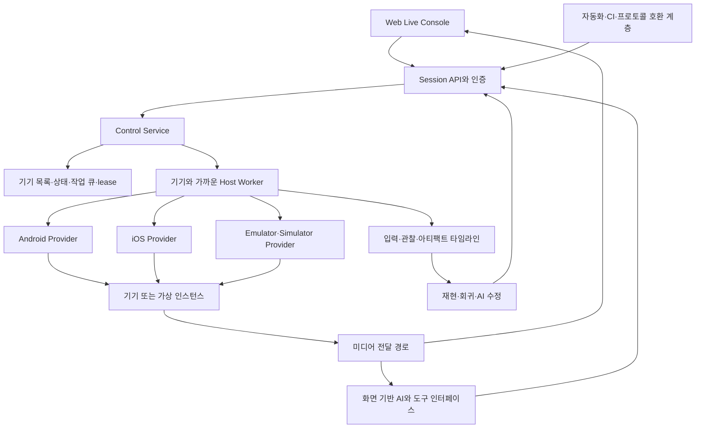

# Reproof 모바일 테스트 플랫폼

2026-09-09 · 제품 방향 전환 · 설계 초안

## 1. 제품 정의와 코드 소유권

목표는 자체 호스팅할 수 있는 오픈소스 모바일 테스트 플랫폼이다. 사용자가 브라우저에서 기기를 직접 조작하고, 동일한 세션을 자동화나 AI에게 넘기며, 기록을 이슈 재현과 수정 검증에 재사용한다. 기기 운영과 원격 조작은 제품의 기반이다.

사용자가 제시한 참고 범위는 Appium, BrowserStack App Live, AWS Device Farm, Corellium이다. 공식 문서에서 확인한 기능과 우리의 설계 결정을 분리한 [참고 제품 비교](PLATFORM-REFERENCE-COMPARISON.md)를 추가했다. 이 문서는 독자 플랫폼의 목표이며 상용 제품과 전체 기능이 동등하다는 뜻은 아니다.

STF 코드·포크·서버·프로토콜에 대한 필수 의존성을 두지 않는다. 세션 모델, 제어 서비스, host worker, 웹 클라이언트와 기록 형식은 직접 설계·구현한다. 표준 프로토콜, 운영체제의 개발 도구, 검증된 미디어·암호화 라이브러리는 필요에 따라 사용한다. 기존 코덱·WebRTC·운영체제까지 모두 새로 작성한다는 뜻은 아니다.

현재의 기록·재현·AI 수정 코드는 플랫폼의 상위 기능으로 보존한다. 지금까지의 샘플 검증 성공을 이 플랫폼 전체의 구현 완료로 표현하지 않는다.

## 2. 제품의 세 가지 사용 방식

| 방식 | 사용자 동작 | 공통 기반 |
|---|---|---|
| Live | 사람이 기기를 선택하고 실시간 화면을 보며 자유롭게 조작 | 세션, 기기 점유, 영상, 입력, 권한 |
| Automation | 스크립트·CI가 같은 기기에서 반복 작업 수행 | 같은 세션과 입력 명령, 실행 증거 |
| Agent | AI가 화면·허용된 UI 정보를 보고 기기를 탐색·재현 | 같은 조작권, 관찰, 기록, 명령 제한 |

세 방식이 서로 다른 기기 소유권 시스템이나 입력 통로를 만들지 않는다. 사람·AI·CI가 입력을 동시에 보내도록 두지 않고, 한 세션의 활성 조작권을 명시적으로 전환한다. 여러 관찰자는 허용할 수 있으나 관찰 권한과 입력 권한은 구분한다.

## 3. 계층 구조

Control Service는 인증·세션·배정·정책을 담당한다. 영상 바이트를 모두 같은 요청 처리 경로로 통과시키지 않는다. Host Worker는 설치·입력·화면 수집·연결 상태·정리를 담당한다. 미디어 경로와 신호 교환은 별도로 확장할 수 있게 한다.

첫 배포는 한 서버와 한 host worker, 작은 데이터 저장소로 시작한다. 여러 서비스를 독립 배포하거나 Kubernetes를 쓰는 것은 규모가 요구할 때 선택한다. 모듈 경계를 먼저 만들고 초기 운영 단위를 단순하게 유지한다.

## 4. Live 조작이 첫 제품 기능

웹 화면에 기기 목록, 상태, 세션 시작·종료, 실시간 화면, 기본 조작, 앱 설치, 기록 시작·종료를 제공한다. 단순히 정적 스크린샷과 ID 클릭 버튼을 제공하는 수준으로 완료 처리하지 않는다.

입력 API의 의미는 기기 독립적으로 정의한다.

- pointer down/move/up/cancel, pointer ID, 좌표와 시각.
- 제한된 다중 터치, drag, long press, swipe.
- key down/up와 텍스트 commit을 별개로 기록.
- 플랫폼이 지원하는 시스템 동작과 화면 방향 변경.
- 설치, 앱 시작·종료, 지원 범위의 상태 초기화.

플랫폼에서 지원하지 않는 동작은 capability에 표시하고 명시적으로 거절한다. 단발성 shell tap이 성공했다고 연속 제스처·멀티터치·IME까지 구현됐다고 주장하지 않는다. 각 provider의 실제 API·권한·성능은 기술 검증에서 확인한다.

UI 좌표에는 `displayId`, 기준 frame ID, 화면 크기·방향, 클라이언트 표시 영역의 변환 정보를 연결한다. 회전·리사이즈·오래된 frame 때문에 의미가 달라진 입력은 잘못된 위치로 보내지 않는다. 입력 주입 acknowledgment와 앱이 기대 결과를 냈다는 판정은 구분한다.

초기 성능 수용 항목은 첫 화면까지의 시간, 화면 갱신율, 조작 후 화면 변화 지연의 p50/p95, 입력 누락, 연결 복구 시간이다. 수치 목표는 Android 기술 검증에서 독립적으로 측정한 기준선 뒤에 고정한다.

## 5. 세션과 조작권

LabSession은 기기·영상·기록을 소유하고 ControllerSession은 현재 입력 주체를 소유한다. Live 세션에 붙은 자동화의 종료와 기기 반납을 같은 사건으로 취급하지 않는다. 단독 CI와 Live attach의 수명 정책을 명시한다. 근거와 제안은 [세션 통합 비교](PLATFORM-REFERENCE-COMPARISON.md)를 참고한다.

세션 상태는 `requested → allocated → connecting → active → draining → closed`를 기본으로 한다. 준비 실패는 `failed`, 종료 후 기기 상태를 보장할 수 없으면 기기를 `quarantined`로 분류한다. 기기 전체의 ready/busy/offline 상태와 개별 작업 결과를 분리한다.

모든 입력에는 session ID, controller ID, lease epoch, command sequence, 만료 시간과 geometry version을 붙인다. worker는 오래된 lease나 조작권의 명령을 실행하지 않는다. 분산 배정에서는 단순 TTL 갱신뿐 아니라 fencing token으로 이전 소유자의 입력을 차단한다.

조작권 인계 순서:

1. 현재 자동화 또는 AI 실행을 일시 정지하고 새 입력 수락을 멈춘다.
2. 진행 중인 입력을 정리하고 활성 pointer를 cancel한다.
3. 마지막 실행 명령과 현재 frame/state checkpoint를 기록한다.
4. 조작권 epoch를 올리고 새 controller에게 부여한다.
5. 이전 controller의 뒤늦은 명령을 거절한다.

연결이 끊겨 pointer 정리를 확인하지 못하면 즉시 다른 사람에게 기기를 넘기지 않는다. 복구·격리 정책으로 처리한다. 이동 이벤트를 합칠 수 있어도 up/cancel 경계를 유실시키지 않는다.

## 6. Android와 iOS provider

### Android

첫 Live 검증 대상이다. 연결된 기기의 실시간 화면과 연속 입력을 독자적인 worker/helper 경로로 구현한다. SDK 없는 원격 조작과 앱 내부 의미 기록을 분리하고, ADB·개발용 권한 범위에서 가능한 기능을 측정한다. 루팅이나 임의의 시스템 권한을 기본 전제로 두지 않는다.

영상 수집·인코딩·전송, touch injection, 회전, 연결 해제·재연결을 작은 기술 검증으로 각각 확인한다. STF의 특정 helper를 가져오는 것으로 구현을 대체하지 않는다. 구체적인 저수준 API 선택은 아직 확정하지 않았다.

### iOS

현재의 XCUITest batch runner는 자동화 기반으로 유지한다. Live를 위해서는 지속되는 테스트 제어 세션과 별도의 화면 전달 경로가 필요하다. Xcode를 입력 한 번마다 다시 실행하는 구조를 Live 완료로 인정하지 않는다.

Simulator Live와 실제 iPhone Live는 다른 provider capability로 둔다. 실기기 서명·pairing·화면 수집·입력·파일 접근의 가용성을 확인하기 전에는 동일 지원을 약속하지 않는다. 호스트의 전체 Keychain이나 서명 계정을 AI에게 노출하지 않는다.

Android와 iOS가 같은 추상 입력을 받더라도 실제 동작·권한·지연은 같다고 가정하지 않는다. provider는 구현한 capability와 검증된 환경만 광고한다.

## 7. 자동화와 호환성

자체 세션·입력 엔진을 기본으로 만들고 그 위에 자동화 프로토콜 어댑터를 둔다. WebDriver/Appium 계열 클라이언트와의 호환은 지원 명령·capability·오류 의미를 명시한 범위부터 구현한다. 호환 테스트가 없는 상태에서 전체 Appium 대체라고 표현하지 않는다.

초기 프로토콜 호환은 C0(session/status/timeout/screenshot/actions/release)부터 검사하고 요소 조회·모바일 확장을 C1/C2로 확대한다. [호환 단계](PLATFORM-REFERENCE-COMPARISON.md)에 공개 API 근거와 수용 기준을 정리했다.

CI 작업은 기기 조건, artifact, fixture, 스크립트, timeout, 결과 보관 정책을 지정한다. 작업 큐가 세션을 얻고 동일 worker를 사용한다. 브라우저 원격 조작과 CI가 같은 기기를 중복 배정하지 못해야 한다.

앱의 사내망·개발 서버 연결을 위한 Network Connector는 제어/미디어와 별도로 둔다. CI의 prepare/run/collect/cleanup 상태와 기기 reset·worker 정리를 각각 기록한다.

기존 Python 도구의 기록·검증 기능을 유지하며 현재의 직접 ADB/XCTest 호출은 점진적으로 Session API 뒤로 옮긴다. 플랫폼 초기 개발을 이유로 검증된 샘플 기능을 버리거나 임의 shell 실행을 공개 API로 열지 않는다.

## 8. 기록·재현·AI

**사람의 시연 → 입력 기록 → 재생/자동화 생성**을 Live의 기본 기능으로 포함한다. [동작 기록·재생 계약](DEMONSTRATION-REPLAY.md)에 입력 출처, 원본/적응형 재생, 편집과 스크립트 내보내기 기준을 정리했다. 원격 콘솔 입력과 휴대폰 자체에서 발생한 직접 터치의 관측 범위를 구분한다.

기록에는 두 층이 있다.

- 장치 계층: frame 참조, 실제 주입한 입력·제스처, 방향·geometry, 세션·조작권 변경, 연결 상태.
- 앱 계층: SDK가 제공하는 의미 ID, 화면 전환, 허용된 앱 상태·진단·fixture 참조.

SDK 없이도 원격 조작과 장치 계층 기록은 가능하도록 설계한다. SDK는 재현의 의미와 초기 상태 복원에 도움을 주는 추가 통합이다. 모든 앱 내부 상태를 SDK 없이 복원할 수 있다고 주장하지 않는다.

AI는 영상/frame 관찰을 바탕으로 좌표·제스처를 선택할 수 있고, UI ID를 사용할 수 있는 화면에서는 이를 함께 활용할 수 있다. 기존 MVP의 ‘좌표 fallback 금지’는 그 샘플의 검증 규칙으로 한정한다. 새 플랫폼은 `manual`, `vision`, `semantic`, `script` 입력 모드를 구분하고 선택한 경로를 증거에 남긴다.

재생한 좌표와 원래 버그의 재현 성공은 다른 사실이다. 화면·시작 상태·artifact·원래 증상·기대 결과를 확인한 뒤에 재현/수정 판정을 내린다. 현재 구현한 반복 판정·보호된 검증기·AI 패치 제한을 이 계층에 재사용한다.

## 9. 가상 기기 범위

공통 자원 모델에 물리 기기와 가상 인스턴스를 모두 수용한다. 초기 제공자는 연결된 실기기와 기존 Android Emulator/iOS Simulator를 운영하는 방식이다. 각 provider가 지원하는 생성·시작·중지·초기화·snapshot capability를 분리한다. snapshot은 app-fixture, storage, memory+storage, clone의 복원 의미를 구분하고 외부 서비스 상태 포함 여부를 따로 기록한다.

OS 가상화 엔진 자체, 전체 OS snapshot, 커널/메모리 관찰 같은 목표는 별도 연구 트랙으로 둔다. 원격 화면 서비스나 Simulator 실행을 완성했다고 이 수준의 가상화까지 완성했다고 표현하지 않는다. 이 경계의 기술적 실현 가능성과 범위는 추가 검토가 필요하다.

이 분리는 장기 목표를 삭제하는 결정이 아니라, Live·세션·worker가 먼저 독립적으로 완성될 수 있게 하는 단계 구분이다.

## 10. 접근과 데이터 경계

기기 목록·화면 보기·입력·앱 설치·데이터 초기화 권한을 구분한다. worker의 ADB 소켓이나 관리용 shell을 브라우저에 직접 공개하지 않는다. 영상 구독과 입력 채널은 세션에 묶인 짧은 수명의 접근 권한을 사용한다.

실시간 화면 접근, 녹화 보관, AI 전송은 각각 별도 정책이다. 비밀번호·토큰 입력은 기본적으로 기록하지 않는다. 영상의 모든 민감정보를 자동으로 식별할 수 있다고 가정하지 않고, 기록 제외 화면·SDK 힌트·operator 정책을 사용한다. 모델에 보낼 수 있는 자료를 명시적으로 제한한다.

작업 종료 시 설치·앱 상태·임시 artifact·입력 상태를 정리하고 정리 실패 기기는 격리한다. 실제 테스트 사용자의 계정·서버 데이터·Keychain 초기화는 앱/fixture 계약 없이는 임의로 수행하지 않는다.

## 11. 배포와 단계별 완료 기준

| 단계 | 산출물 | 완료 기준 |
|---|---|---|
| P0: 플랫폼 계약과 기술 검증 | 세션·입력·영상·worker capability 계약, 플랫폼별 spike | 실제/가상 환경별 지원·미지원과 지연 기준선 확인 |
| P1: Android Live 한 대 | 웹 화면·독자 worker/helper·연속 입력·시연 기록/재생 | 원격 조작을 저장하고 같은 시작 조건에서 다시 실행. drag/long press, 회전·재연결, lease 위반 차단 |
| P2: 기본 팜 운영 | 기기 목록·배정·큐·복구·역할 | 여러 기기/worker에서 중복 배정·만료 입력·정리 실패 검사 |
| P3: iOS Live | Simulator Live, 실기기 provider 검증 | 지속 제어 세션과 영상, 플랫폼별 capability·서명 경계 명시 |
| P4: 자동화·CI 호환 | Session API 기반 작업 실행·프로토콜 어댑터·기록의 스크립트 내보내기 | 같은 기기에 대한 Live/자동화 충돌 차단, 지원 명령 호환 검사 |
| P5: 세션 기록·화면 기반 AI | frame+입력 타임라인, 인간/AI 인계 | ID 없는 화면의 조작·이슈 회수·인계 후 중복 입력 방지 |
| P6: 재현·수정 통합 | 기존 replay/repair를 세션 서비스에 연결 | 원본 재현·제한된 AI 패치·증거 기반 수정 검증 |
| R: 고급 가상화 연구 | 별도 기술 검증과 범위 결정 | 단순 원격 제어와 구분되는 증거·비용·운영 조건 확보 |

P1과 P3는 실제 기기 연결 전에도 웹 클라이언트, 프로토콜, mock provider, Simulator 측 일부 구현을 진행할 수 있다. 실제 입력·영상·서명에 대한 검증 완료는 해당 환경에서 수행해야 한다.

기존 replay/repair 프로토타입에 공통 세션과 iOS Simulator의 지속 제어·sampled frame·gesture-batch 녹화/재생 경로를 추가했다. [현재 구현과 검증](LIVE-QA.md)은 위 단계별 전체 완료와 구분한다. 다음 우선순위는 Android 연속 입력과 미디어 기술 검증, 기본 팜 운영이다.

## 12. 외부 비교와 미정 사항

확정: STF 종속 없이 직접 구현, self-hosted 오픈소스, Live 조작을 기반으로 자동화·AI 통합, 기존 구현 보존.

미정: 영상 전송/인코딩 구체 구현, Android 입력 helper 방식, iOS 지속 제어 방식, 프로토콜 호환 범위, 고급 가상화 범위, 초기 배포 라이선스와 운영 규모 목표.

STF의 최근 유지보수 상태나 특정 포크의 선호도를 확인한 것으로 주장하지 않는다. 독자 구현은 사용자가 선택한 제품 방향이며, 유지보수 추측을 기술적 근거로 사용하지 않는다. Appium·BrowserStack App Live·AWS Device Farm·Corellium의 공식 문서 비교는 완료해 [근거 문서](PLATFORM-REFERENCE-COMPARISON.md)에 반영했다. 세부 provider 기술·성능과 전체 호환성은 후속 기술 검증 대상이다.
