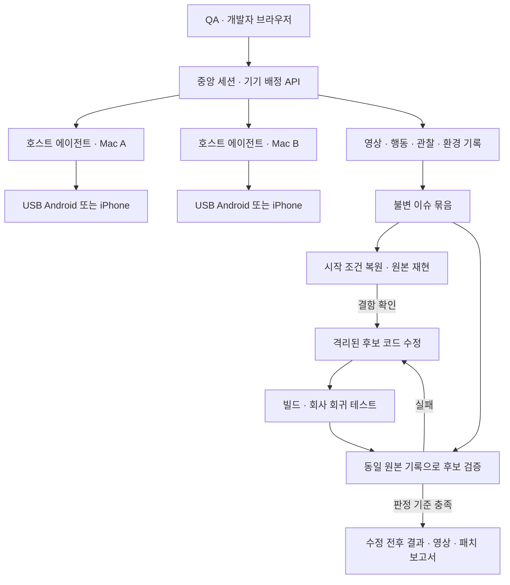

# 회사 QA 이슈 재현·수정·검증과 실기기 팜

2026-09-11 · 사용자 목표 명확화에 따른 제품 기준

## 목표

QA가 문제를 발견한 한 번의 테스트에서 영상, 실행 가능한 행동, 진단 로그와 시작 조건을 함께 남긴다. 개발자는 기기를 빌리거나 QA에게 절차를 다시 설명받지 않고 이 기록으로 결함을 재현한다. AI가 수정 후보를 만들면 같은 원본 기록과 보호된 검증 기준으로 수정 여부를 확인한다. Android와 iPhone은 각 호스트에 USB로 연결한 채 중앙 콘솔에서 공유한다.

**완료 기준은 실제 회사 앱의 실제 QA 이슈를 다른 작업자가 원격 실기기에서 반복 재현하고, 수정 전 실패와 수정 후 성공을 같은 기준으로 확인하는 것이다.** 샘플 카운터 통과, 화면 미러링, 관찰 로그 생성만으로 제품 전체를 완료 처리하지 않는다.

## 공개 사례에서 확인한 것

| 사례 | 확인한 내용 | 우리 설계에 적용할 점 |
|---|---|---|
| 토스 네뷸라, 2026-07-30 | 팀별 맥북·맥미니에 흩어진 기기를 중앙 API와 호스트 에이전트로 통합했다. iOS는 Mac mini, Android는 Linux 호스트를 쓰며 기기 점유를 관리한다. ADB/UiAutomation과 Swift/XCTest 위에 전용 드라이버를 두고 미러링·SDK·CLI를 연결한다. | 호스트 위치를 사용자에게 숨기고 기기 예약·제어·영상·작업을 공통 API로 제공한다. [공식 글](https://toss.tech/article/device-farm-nebula) |
| 토스 토션, 2026-08-11 | 케이스·자동화 실행·단계별 결과·스크린샷·영상·이력을 연결하고 AI를 케이스/코드 생성과 화면 검수에 활용한다. | 이슈, 시나리오, 앱 빌드, 원본/후보 실행 결과를 같은 화면과 ID 체계로 묶는다. [공식 글](https://toss.tech/article/tossion) |
| PlaytestCloud, 2020 공개 사례 | 게임 코드에 고객이 SDK를 직접 통합하지 않도록 빌드에 wrapper를 주입해 영상과 터치를 수집했다. 이 wrapper를 Appium과 AWS 실기기에서 자동 검증했다. | 수집기 자동 연결과 그 수집기 자체의 기기 검증은 실제 산업 사례가 있다. 현재 모든 앱/IPA에 동일하게 적용 가능하다는 근거로 확대하지 않는다. [공동창업자 기고](https://aws.amazon.com/blogs/gametech/how-playtestcloud-uses-aws-device-farm/) |
| AWS Device Farm / BrowserStack | 원격 실기기 조작과 자동화 실행을 제공한다. AWS는 원격 세션의 Appium 연결을, BrowserStack은 테스트 영상 보관을 문서화한다. | 외부 팜도 제공자 인터페이스 뒤에 연결할 수 있다. [AWS](https://docs.aws.amazon.com/devicefarm/latest/developerguide/appium-endpoint-interaction.html), [BrowserStack](https://www.browserstack.com/docs/app-automate/appium/debug-failed-tests/video-recording) |
| Appium Inspector | 지원하는 사용자의 조작을 실행 코드로 기록한다. | 실행 기록은 명령·요소 선택·입력으로 구성한다. 영상이나 진단 메시지를 실행 코드와 혼동하지 않는다. [Recorder 문서](https://github.com/appium/appium-inspector/blob/main/docs/session-inspector/recorder.md) |

네뷸라 글은 계정·데이터·로그인 상태 등 테스트 조건을 빠르게 준비하는 작업을 후속 목표로 구분한다. 공개 자료만으로 토스가 임의 QA 로그에서 모든 상태를 복원하고 앱 소스 자동 수정까지 완결했다고 단정하지 않는다. [네뷸라의 다음 단계](https://toss.tech/article/device-farm-nebula)

사용자가 준 [영상](https://www.youtube.com/watch?v=YCNcTpcDRf8)은 공개 메타데이터에서 「토스 FE 개발자들의 검증법」, 토스 챌린저스 채널로 확인했다. 자막은 확보하지 못했다. 위의 구현 설명은 영상 전문을 본 것처럼 추정한 내용이 아니라 별도로 확인한 공식 글과 문서에 근거한다.

## 한 이슈에 묶을 자료

| 자료 | 역할 | 필수 내용 |
|---|---|---|
| 영상 | 사람이 문제와 전후 화면을 이해 | 실제 재생 가능한 파일, 시간축, 공백/연결 단절 구간, 빌드·기기 연결 |
| 실행 기록 | 도구가 행동을 다시 수행 | 원본 event ID, tap/입력/스크롤/시스템 동작, 안정된 요소 선택자, 대기·시작 전제, 입력 변수 참조 |
| 관찰 로그 | 원인과 상태 변화를 설명 | 클릭 앞뒤, 화면·라이프사이클, 오류·요청 추적 등 지원 관찰과 누락 표시 |
| 환경·fixture | 같은 시작 조건을 준비 | 앱/커밋/OS, 테스트 계정·데이터 seed, 기능 플래그, 권한·언어·시간 조건, 필요한 API 응답/테스트 백엔드 버전 |
| 검증 기준 | 재현과 수정 성공을 판정 | 실제 현상과 기대 결과, UI·서버 부작용·크래시 등의 판정, 회사 회귀 테스트 |

영상과 관찰 로그는 설명 자료다. 실행 기록과 복원 가능한 조건이 자동 재현을 담당한다. 같은 버튼을 눌러도 서버 응답이나 로그인 상태가 달라지면 같은 결함을 재현했다고 할 수 없다.

초기에는 **QA가 원격 콘솔로 조작하는 경로**를 기준으로 명령을 자동 기록한다. 기기에 직접 손으로 수행한 모든 터치를 원격 명령 로그가 자동으로 포착한다고 가정하지 않는다. 직접 터치까지 지원하려면 앱/플랫폼별 수집 범위를 별도로 검증한다.

비밀번호·토큰은 기록을 그대로 복사하는 대신 승인된 테스트 계정/비밀 저장소 참조로 다시 공급한다. 필요한 값이나 상태를 복원할 수 없으면 해당 기록은 영상·진단 자료로 보관하고, 완전 자동 재현 가능으로 표시하지 않는다.

## 연결 구조 — 제안

중앙 서비스는 사용자·호스트·기기의 권한, 점유와 작업 이력, 산출물 연결을 관리한다. 호스트 에이전트는 가까운 USB 기기를 발견하고 설치·입력·수집·정리를 수행한다. iPhone을 제어하는 호스트는 Mac으로 둔다. 현재 연결된 맥북들을 등록해 시작할 수 있고, 상시 운영 단계에서는 절전·이동이 적은 전용 호스트로 옮긴다.

기기당 입력 주체는 하나다. 사용자가 관찰을 공유하더라도 사람·재현기·AI의 조작권을 구분한다. 연결 단절이나 호스트 재시작으로 이전 작업의 소유권이 불분명하면 기기를 즉시 재할당하지 않는다.

현재 ADB/UiAutomation·XCTest 구현을 제공자 계층으로 활용한다. 공통 API와 기록 계약을 먼저 안정화하고, 드라이버 교체나 미디어 고도화는 실제 병목 측정에 따라 선택한다. 초기 두 호스트에 대규모 메시지 브로커나 수백 대 운영 구성을 그대로 도입할 필요는 없다.

## 현재 저장소의 위치

2026-09-12 현재 로컬 소프트웨어 검증과 실제 회사 환경의 수용 검사를 구분한다.

| 영역 | 현재 구현과 검증 범위 | 남은 제품 간격 |
|---|---|---|
| 원격 화면·조작·영상 | Android/iPhone provider, 실제 AVFoundation MP4, 브라우저 재생·action/gap 탐색, 불변 보관 | 회사 기기에서 촬영 시각·coverage 확인. 매핑되지 않은 원격 native 시각은 unknown |
| 실행 기록 | 좌표/제스처·변수 참조, 별도 명세 revision/승인, 고정 원본 반복 재현 | 실제 회사 앱의 locator·대기·관찰 계약 |
| 자동 관찰 | Views/UIKit 클릭·화면·라이프사이클 로그, Live 조회·내보내기 | 앱 스택 적응과 앱/서버 진단. app-log 자체는 실행 입력이 아님 |
| 재현 환경 | 등록된 fixture의 준비·정리, 상태·coverage 검사, 실패/중단 보존 | 회사 계정·데이터·플래그·API 상태의 실제 복원과 관찰 구현 |
| 수정·검증 | 일반 제품 텍스트 패치, 원본·검증 규칙 보호, 빌드/서명/독립 검사/후보 재생의 감독 코드와 UI·CLI | 실제 VM·signer/inspector·모바일 격리 provider·회사 회귀 관찰·AI 전송 정책. 현재 보호 실행 검사는 명시적인 대역 |
| 기기 팜 | 프로젝트 권한·등록·물리 scope 점유·워커 프로필·영속 artifact 전송, 실제 worker CLI 두 프로세스 | 서로 다른 Mac/TLS·실기기·회사 앱의 실제 운영 수용 검사 |

운영 문서는 [공유 QA 화면](ISSUE-WORKFLOW.md), [워커](WORKER-RUNTIME.md), [프로젝트 수정·검증](PROJECT-REPAIR.md), [보호 실행](REPAIR-EXECUTION.md)에 있다. 코드 진입점은 [이슈 워크플로](../reproloop/live/issue_workflow.py), [재현 실행기](../reproloop/scenario_runner.py), [일반 수정](../reproloop/project_repair.py), [보호 검증 조합](../reproloop/repair_verification.py)이다.

현재 고유 검사 1,026개 중 1,023개에 통과 근거가 있고 고정 Android 의존성 검사 3개는 차단됐다. [최신 인수인계](../HANDOFF.md)를 따른다. 새 G9 검사에서 실제 AI·VM·실기기를 실행하지 않았으며, 내부 소프트웨어 판정 통과를 회사 QA 제품 전체의 완료 증거로 확대하지 않는다. 한 수정 작업의 제안 예산은 1개이며 실패 시 자동으로 예산을 초기화하지 않는다.

## 다음 구현·검증 순서

1. **실제 두 호스트와 기기 공유**
   서로 다른 두 Mac에 연결된 Android/iPhone을 한 콘솔에서 발견·점유·조작·반납한다. 동일 기기 중복 요청, 케이블 분리, 호스트/네트워크 단절을 검증한다. 회사 인증과 접근 범위를 연결하고 영상·파일 회수 경로도 함께 정의한다.
2. **실제 QA 이슈의 기록과 재현**
   회사 앱의 실제 문제를 플랫폼별 최소 한 건 선정한다. 영상·실행 기록·환경·fixture·검증 기준을 묶어 새로 배정한 기기에서 최소 3회 재현한다. 인증/서버 상태가 다른 기록을 재현 성공으로 판정하지 않는다. 단순 UI 이슈뿐 아니라 상태 의존 이슈를 포함한다.
3. **동일 기록을 사용하는 AI 수정 검증**
   원본 재현이 확인된 묶음만 AI에 넘긴다. 실제 코드베이스의 허용 범위에서 후보를 만들고 회사 테스트와 원본 시나리오를 반복 실행한다. AI는 원본 기록·fixture·검증 기준을 바꿔 성공을 만들 수 없다. 의도적으로 잘못된 수정과 재현 실패 사례가 `verified`가 되지 않는지 확인한다.

단계별 결과는 다음 단계의 입력이다. 앱 스택과 실제 QA 사례가 확인되기 전까지 샘플 어댑터 확장을 일반 앱 적용의 대체로 삼지 않는다.

## 실제 접속 전에 필요한 입력

- 회사 앱의 스택과 테스트 빌드/소스 경로.
- 대표 QA 이슈와 기대 결과, 테스트 계정/서버 조건을 만드는 방법.
- 두 Mac 및 연결 기기의 운영 방식과 접근 가능한 네트워크.
- 회사가 허용하는 AI 실행 환경과 소스·QA 자료 제공 범위.

공개 사례 조사와 로컬 소프트웨어 구현·검증을 수행했다. 회사 기기 팜 배포나 회사 소스·QA 자료의 외부 전송은 수행하지 않았다.
