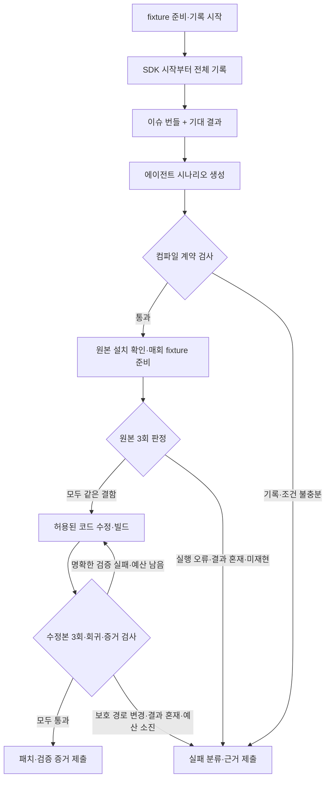

# Repro Loop — QA 기록 기반 모바일 버그 재현·수정 계획

이 문서는 기존 replay/repair 프로토타입의 상세 계획을 보존한 것입니다. 현재 제품 방향과 우선순위는 [상위 플랫폼 계획](../PLAN.md)을 따릅니다.

작성일: 2026-09-08 · 개정일: 2026-09-09 · 상태: 4개 트랙 리뷰 반영, 구현 전 · 프로젝트 이름: 가칭

이번 개정은 Claude·Antigravity·Grok·Codex 리뷰의 R1~R11을 설계와 완료 기준에 반영한다. 기존 리뷰는 개정 전 문서에 대한 기록이며, 개정안의 구현 검증이나 재리뷰를 완료했다는 뜻은 아니다. 반영 위치는 14절에 정리한다.

## 1. 만들려는 결과

QA가 실기기에서 앱을 사용하다 이슈를 발견하면, 직전 세션을 보존하고 기대 결과를 짧게 남긴다. 시스템은 기록을 실행 가능한 재현 시나리오로 변환한다. 에이전트는 같은 앱 빌드와 준비된 테스트 상태로 실제 기기에서 실패를 확인하고, 소스를 수정하고, 다시 빌드하여 같은 조건으로 검증한다.

목표는 QA가 이미 수행한 절차를 사람이 반복해서 입력하는 부담을 줄이는 것이다. 모든 버그를 완전 자동으로 재현하거나 수정한다고 약속하지 않는다. 기록 부족, 상태 복원 실패, 비결정적 실패는 명시적인 결과로 남긴다.

첫 제품의 중심은 디바이스 팜 관리 화면이 아니라 **실행 가능한 이슈 번들, 신뢰할 수 있는 재현 실행기, 수정 전후 검증 증거**다.

## 2. 범위와 가정

### 첫 버전에 포함

- 소스와 빌드 방법을 확보한 Android 테스트 앱 한 개.
- 기록 SDK를 통합할 수 있는 Kotlin 앱의 지정 화면과 공통 UI 컴포넌트.
- 개발 머신에 USB로 연결된 실기기 한 대.
- fixture 준비 후 시작하는 명시적인 QA 기록 세션. 시작부터 이슈 발생까지의 전체 입력을 보존한다.
- 탭, 텍스트 입력, 스크롤, 뒤로 가기와 명시적 상태 대기.
- 의미 있는 UI 식별자, 앱 내부 이벤트, 오류, 필요한 화면 증거 기록.
- 테스트 계정과 fixture로 시작 상태를 재설정하는 앱별 어댑터.
- 로컬 파일 기반 이슈 번들, CLI 실행기, HTML 결과 리포트.
- 에이전트 도구 인터페이스와 제한된 수정·빌드·검증 루프.

### 후속 범위

- 여러 Android 기기의 예약·대여·복구와 환경별 실행.
- 기존 디바이스 팜 연결 어댑터.
- Flutter, React Native, iOS 기록·실행 어댑터.
- 네트워크 fixture 재생과 시간·난수 제어.
- 임의 시점의 상태 checkpoint 복원과 최근 구간만 보존하는 기록 모드.
- 팀용 웹 UI, 이슈 트래커 연결, 장기 보관.

### 초기 제외

- SDK 없이 임의의 앱에서 모든 사용자 동작을 완벽하게 기록하기.
- 운영 계정·실제 결제·운영 데이터 변경을 포함한 자동 재실행.
- 멀티터치·게임·임의의 Canvas·외부 앱을 넘나드는 시나리오의 일반 지원.
- IME 조합·키 입력별 부작용·정밀 타이밍에 의존하는 입력 재현. 첫 버전의 텍스트 입력은 필드 완료값 치환으로 제한한다.
- 재현 확인 없이 패치를 성공으로 판단하거나 자동 병합하기.

이 문서는 현재 요구를 바탕으로 한 설계안이다. 외부 네트워크 조회와 경쟁 프로젝트 조사는 수행하지 않았다. 후보 기술의 최신 지원 범위, 라이선스, 유지보수 상태는 구현 착수 시 별도로 확인한다.

## 3. 사용자 흐름

1. 개발자가 테스트 빌드에 SDK, 화면 식별자, fixture 어댑터를 연결한다.
2. 호스트가 기기를 독점 점유하고 fixture를 준비한다. QA가 기록 시작을 누르면 SDK가 fixture 버전·입력 참조와 시작 상태를 연결하고, 이후 수동 입력 전체를 보존한다.
3. QA가 이슈 버튼을 누르고 실제 결과와 기대 결과를 남긴다. 단계별 재현 절차는 필수 입력으로 받지 않는다.
4. SDK와 호스트가 확보한 기록을 이슈 번들로 고정한다. 크래시로 이슈 버튼을 누를 수 없으면 다음 실행 또는 호스트에서 복구 세션을 선택하고 실제·기대 결과를 연결한다. 복구 과정의 동작은 원래 세션에 섞지 않는다.
5. 에이전트가 시나리오와 판정 조건 초안을 만들고, 독립 검증기가 이벤트 대응·시작 상태·판정 근거를 검사해 고정한다.
6. 실행기가 기록 당시의 원본 APK와 기기 설치본을 확인하고 매 실행마다 fixture를 재준비한다. 고정된 시나리오로 원본을 3회 재현한다.
7. 유효한 3회 모두 같은 결함을 확인하면 에이전트가 별도 작업 공간의 허용된 제품 코드를 수정한다. 결과가 섞이면 수정 루프에 진입하지 않는다.
8. 수정 빌드에 같은 조건을 3회 실행하고 관련 회귀 검사도 수행한다. 모든 실행 증거와 보호 경로 검사를 통과해야 수정 완료로 판정한다.
9. 패치와 전후 실행 증거를 제출한다. 재현 불가 또는 검증 불충분이면 그 이유를 제출한다.



## 4. 구성 요소와 책임

| 구성 요소 | 책임 | 초기 구현 방향 |
|---|---|---|
| Android Recorder SDK | 수동 QA 동작과 앱 맥락 기록, 민감정보 제외 | Kotlin, 앱 내부 계측 |
| Bundle Store | 버전이 있는 번들과 아티팩트 보관 | 로컬 디렉터리, JSON/JSONL |
| Scenario Compiler | 이벤트를 타깃·대기·검증 조건으로 변환 | 규칙 기반 정규화 + 에이전트 보완 |
| Device Runner | 설치·실행·관찰·입력·증거 수집 | ADB + UI Automator 기반 후보 |
| Fixture Adapter | 계정·데이터·앱 초기 상태 준비 및 검증 | 테스트 앱별 계약 |
| Agent Bridge | 번들 조회와 기기 명령을 에이전트에 노출 | 제한된 도구 API, 이후 MCP 어댑터 |
| Repair Orchestrator | 원본 재현, 수정 시도, 빌드, 검증 상태 관리 | 호스트 프로세스 |
| Independent Verifier | 조건·이벤트 대응·설치 증거·보호 경로 검사 | 수정 작업 공간 밖의 고정된 코드와 승인 기준 |
| Reporter | 단계별 실패와 전후 증거 표시 | 정적 HTML |

호스트 CLI는 Python을 초기 후보로 둔다. Android 계측은 Kotlin으로 분리한다. 구체적인 라이브러리와 버전은 0단계 기술 검증 뒤 고정한다.

REPL은 필수 구성 요소가 아니다. 처음에는 구조화된 도구 호출과 시나리오 실행으로 구현한다. REPL을 추가하더라도 동일한 세션·시간 제한·기기 소유권 규칙을 적용한다.

## 5. 기록 설계: 자동화 실행과 수동 입력 수집을 구분

UI 자동화로 기기를 조작할 수 있다는 사실만으로 QA의 수동 동작을 자동으로 수집할 수 있는 것은 아니다. 첫 기술 검증은 테스트 앱에서 실제 손으로 수행한 동작을 SDK가 얼마나 정확하게 기록하는지 확인하는 데 둔다.

- 지정된 공통 UI 컴포넌트에 안정적인 `reproId`와 이벤트 계측을 추가한다.
- 화면 전환, 입력 완료, 탭, 스크롤 같은 의미 단위로 이벤트를 기록한다. 6절의 실행 파라미터가 없는 동작은 추측하지 않고 미지원으로 표시한다.
- SDK 이벤트를 주 기록으로 삼고, 연결된 호스트의 UI 트리·스크린샷을 보조 증거로 사용한다.
- 테스트용 UI 식별자가 실행기에서도 조회되는지 확인한다. 내부 ID가 자동으로 UI 트리에 노출된다고 가정하지 않는다.
- SDK가 전체 OS UI 트리를 확보할 수 있다고 가정하지 않는다. 외부 화면이나 미계측 화면은 지원 범위 밖으로 표시한다.
- 단조 증가 시각과 sequence 번호를 사용한다. 호스트 시각과의 대응은 별도로 기록한다.
- 이슈 등록 시 마지막 포함 이벤트의 `endSequence`를 고정하고 영속 저장을 마친 뒤 번들 해시를 계산한다. 이후 입력은 새 세션에 기록한다. 크래시 복구 시에는 마지막 영속 sequence와 호스트의 크래시 증거를 연결하고, 재현에 필요한 입력 유실 여부를 명시한다.
- MVP는 기록 시작부터 최대 10분·20MB의 세션을 보존한다. 용량 예산에는 영속 저장 이벤트와 이미지 등 로컬 기록 아티팩트를 모두 포함한다. 제한에 도달하면 앞부분을 지우지 않고 기록을 종료하며 `truncated=true`로 고정한다. 잘렸거나 유실된 세션은 진단용으로만 사용하고 자동 재현 대상으로 인정하지 않는다. 수치는 0단계 실측 후 변경할 수 있으나 실행별 적용값을 기록한다.
- `startState`에는 시작 화면의 안정적 ID, fixture 이름·버전·입력 digest, 허용된 앱 상태의 정규화 digest를 기록한다. 초기 상태부터의 이벤트를 모두 보존하므로 MVP는 임의 화면 스냅샷 복원을 구현하지 않는다.
- 크래시 직전 기록은 작은 단위로 로컬에 지속 저장하고, 다음 실행 또는 호스트에서 회수한다. 강제 종료 시 유실 구간도 표시한다.
- 모든 프레임 캡처 대신 주요 화면 전환·동작 주변의 증거 수집부터 시작한다.

민감한 화면은 이미지 수집 자체를 생략하는 방식을 우선한다. 비밀번호·토큰·개인정보는 원본 저장 전에 제외한다. 텍스트 입력은 테스트 fixture의 변수 참조로 대체할 수 있게 하고, 인증 상태는 저장된 쿠키 대신 실행 시 테스트 계정으로 준비한다.

수집 허용 필드와 화면 정책을 SDK·호스트에 동일하게 적용한다. 이미지 수집의 안전 여부가 불명확하면 캡처를 생략한다. 로그·UI 트리·예외 메시지에도 저장 전 필터를 적용하고, HTML에는 정제된 데이터만 이스케이프해 출력한다. 테스트 전용 가짜 비밀값을 입력·화면·UI 트리·진단 로그 각각에 넣어 버퍼, 번들, HTML, export 전부에서 제외되는지 검사한다. 자동 외부 전송은 기본적으로 끄고 전송할 아티팩트와 대상을 명시한다. 기록은 로컬 7일 보관을 초기값으로 두며 번들·실행 결과·export를 함께 삭제할 수 있게 한다. OS·기기 수준의 완전 삭제를 보장한다고 표현하지 않는다.

## 6. 이슈 번들과 시나리오 계약

아래는 구현할 형식의 초안이며 현재 존재하는 API가 아니다.

```text
issue-bundle/
  manifest.json          # schemaVersion, sessionId, 원본 설치·빌드 정보, 파일 해시
  issue.json             # 실제 결과, 기대 결과, 발생 시점
  events.jsonl           # 순서·시각·동작·대상·화면
  diagnostics.jsonl      # 정제된 앱 오류와 상관관계 ID
  environment.json       # locale, orientation, 앱 설정 등
  fixture.json           # 초기화 어댑터 이름·버전·비밀값 없는 변수 참조
  start-state.json       # 기록 시작 시점의 화면·정규화 상태·fixture 연결
  artifacts/             # 허용된 화면 증거와 UI snapshot
```

생성한 `scenario.json`, `oracle.json`, `coverage.json`과 실행별 `runs/<run-id>/`는 원본 번들과 분리한다. 원본 기록은 불변이다. 앱 바이너리는 번들에 공개하지 않아도 되지만, 호스트가 접근할 수 있는 아티팩트 저장소에 기록 당시 설치 가능한 APK 또는 split APK 집합을 반드시 확보한다. 확보하지 못하면 `environment_blocked`이며 커밋 재빌드로 원본을 대체하지 않는다.

시나리오의 각 단계는 `sourceEventIds`, `action`, `target`, `parameters`, `precondition`, `completionCondition`, `timeout`을 가진다. `oracle.json`은 실제·기대 결과의 근거와 8절의 판정 조건을 담고, `coverage.json`은 모든 기록 이벤트가 어느 단계로 변환되었는지 또는 왜 실행에서 제외됐는지를 담는다.

### ID와 입력 의미

지원 컴포넌트는 공통 `reproId`를 Android 테스트 빌드의 자동화 트리에서 조회 가능한 selector로 노출한다. 0단계에서 선택한 UI 프레임워크별 매핑을 검증하고 버전이 있는 SDK·실행기 계약으로 고정한다. ID가 보이지 않거나 여러 요소에 일치하면 실행을 중단한다. 속성·좌표를 이용한 진단은 허용하되 그 실행으로 MVP 합격이나 `verified`를 판정하지 않는다.

| 동작 | 필수 파라미터와 실행 의미 |
|---|---|
| 탭 | 대상 reproId, 동작 전 조건, 완료 조건. 연속 탭을 임의로 합치지 않음 |
| 텍스트 입력 | 대상 reproId, 안전한 값 또는 fixture 변수 참조, `replace` 모드. 필드 완료값을 치환하고 관찰된 값을 확인. IME 중간 상태와 키별 부작용은 미지원 |
| 스크롤 | 컨테이너 reproId, 방향, 종료 기준. MVP는 지정된 항목 ID의 가시 상태 도달을 사용하고 최대 횟수·시간을 둠. 기록에서 종료 타깃을 특정할 수 없거나 정밀 오프셋이 필요하면 미지원 |
| 뒤로 가기 | 출발 화면 ID, 기대 도착 화면 ID, 최대 대기 시간 |
| 상태 대기 | 기록 또는 고정된 화면 계약에서 유래한 관찰 조건, 시간 제한, 근거 이벤트 |

시각·순서를 기록하되 이것만으로 원래 타이밍을 재현한다고 보지 않는다. 명시적 완료 대기로 원래 결함이 사라지는 타이밍 의존 시나리오는 MVP 미지원으로 분류한다.

### 이벤트와 시나리오 대응 검사

모든 사용자 동작은 실행 단계에 연결해야 한다. 화면 관찰 같은 보조 이벤트는 고정된 변환 규칙에 따라 assertion·대기·진단 근거로 연결할 수 있다. 중복 관찰 이벤트 제외에는 규칙 ID와 이유를 남기고 사용자 동작의 무단 삭제·재정렬은 금지한다. 미지원·유실·잘림은 이유를 표시하고 자동 수정 루프를 차단한다.

에이전트가 로그에 없는 입력을 시나리오에 추가할 수 없다. fixture 준비는 재현 입력과 분리된 어댑터 작업이다. 조사 중의 자유로운 기기 조작은 별도 진단 run에 남기며 재현 성공 증거로 사용하지 않는다. 검증기는 sourceEventIds 전체 대응, 파라미터, 순서와 제외 사유를 고정된 규칙으로 검사한다. 의미가 모호하거나 조건 근거가 부족하면 `inconclusive`다.

고정 sleep보다 명시적인 화면·요소·앱 상태 대기를 사용한다. 재시도가 중복 제출 같은 부작용을 만들 수 있으므로 입력 동작을 무조건 재시도하지 않는다.

## 7. 상태 복원과 재현의 한계

입력 로그만으로 서버 데이터, 계정 상태, 시간, 난수, 응답 순서를 복원할 수 없다. 첫 버전에서는 준비 가능한 fixture와 결정적인 앱 버그부터 지원한다.

- QA 기록 전에 원본 설치 아티팩트와 소스 상태를 연결한다. manifest에는 커밋·미커밋 diff digest, APK별 SHA-256, package ID·version, 빌드 variant·축소/난독화 설정, 서명 식별자, 필요한 mapping 파일 참조를 기록한다.
- 모든 run에서 기기를 독점 점유하고 앱 종료·데이터 초기화·권한·언어·방향·테스트 계정 준비를 수행한다. 설치된 APK 집합의 digest와 예상 package·서명이 맞는지 확인하며, 확인 불가능하거나 다르면 `environment_blocked`다.
- fixture는 기록 시작 시점의 어댑터 버전·안전한 입력 참조·seed digest를 재사용한다. `prepare → assertStartState → teardown`을 계약으로 두고 준비 재시도의 멱등성과 종료 후 정리를 보장한다. 시작 정보가 없는 번들은 `invalid_bundle`, 준비 후 시작 상태가 다르면 `environment_blocked`다.
- 서버 데이터는 테스트 전용 환경에서 시드하고, 실행별 데이터 영역을 분리한다.
- 비교용 상태 digest는 테스트용 상태 allowlist로 계산한다. 시간·실행별 namespace처럼 달라질 값은 비교 규칙에서 명시적으로 정규화한다. 서버 배포·설정 식별자도 고정하며 원본과 수정본 비교 도중 바뀌면 비교를 중단한다.
- 응답 본문 전체 저장과 임의 네트워크 재생은 초기 필수 범위에서 제외한다.
- 기기 연결 해제·점유 상실·정리 실패는 실행을 실패 처리하고 기기를 격리한다. 단일 기기 MVP부터 lease를 사용한다. 호스트 외부의 수동 조작을 완전히 막는다고 가정하지 않고, 간섭이 관찰된 run은 무효로 처리한다.
- 외부 서비스나 타이밍 때문에 준비·관찰 조건을 충족하지 못하면 `environment_blocked` 또는 `inconclusive`다. 정상적으로 준비·관찰한 실행에서만 결함 미관찰을 `not_reproduced`로 보고한다.

각 run의 증거에는 `jobId`, `attemptId`, `runId`, 원본·수정 구분, 소스·patch digest, 빌드 계약·toolchain 식별자, 빌드 산출물·실제 설치 확인, fixture·시작 상태 검사, scenario·oracle·coverage digest, 검증기 버전, 단계별 결과를 포함한다. 빌드 산출물이 해당 소스에서 나왔다는 기록과 설치 확인이 누락되면 `verified`가 될 수 없다. 이전 빌드 캐시·오래된 APK가 섞인 경우를 실패 경로로 검사한다.

## 8. 재현 판정과 AI 수정 루프

### 판정 규칙

- `runValid`: 설치·fixture·시작 상태·이벤트 대응이 유효하고 결함 관찰 지점에 도달했는지 확인한다. 보고된 결함 자체인 크래시는 관찰할 수 있지만 다른 크래시·자동화 타임아웃은 유효한 재현이 아니다.
- `bugCondition`: QA가 남긴 실제 결과와 기록된 화면·진단에서 도출한 결함 증상이다. 원본에서 단순히 정상 assertion이 실패했다는 사실만으로 이 조건을 참으로 보지 않는다.
- `expectedCondition`: QA 기대 결과에서 도출한 정상 동작이다. UI 상태·앱 상태·테스트 서버 결과처럼 관찰 가능한 조건을 사용한다.
- 조건에는 근거 이벤트·관찰 시간 구간·판정 방식을 기록한다. 예를 들어 결제 완료 누락 이슈는 결제 화면 도달, 제출 동작, 정해진 기간 내 완료 상태 유무와 보고된 오류를 각각 확인한다.
- 단계의 `completionCondition`은 다음 입력을 안전하게 수행할 수 있는 상태 또는 결함 관찰 구간의 종료를 뜻한다. 마지막 단계에 정상 결과만을 대기 조건으로 넣어 원래 결함을 자동화 타임아웃으로 바꾸지 않는다. 해당 구간의 정상·결함 결과는 별도 oracle이 판정한다.
- 크래시 지문은 가능하면 해당 빌드의 mapping을 적용한 예외 타입과 관련 프레임 시그니처로 비교하고 변동하는 줄 번호는 제외한다. 다른 예외는 같은 결함으로 인정하지 않는다. 정상 조건은 해당 입력 절차를 끝내고 기대 상태에 도달하는 것까지 요구한다.
- 조건이 모호하거나 시각 판단에 사람이 필요하면 `inconclusive`로 종료한다. 추가 설명·판정 검토 후 새 job으로 원본 검증부터 시작하며 자동으로 성공 판정하지 않는다.

### 반복 검증

실제 QA 이슈의 기본값은 원본·수정본 각각 **N=3회**다. 결정적 샘플의 단계 통과 검사는 **N=5회**로 더 엄격하게 적용한다. N과 시간 제한은 원본 실행 전에 job 정책에 고정하며 결과를 본 뒤 줄이지 않는다. 매회 7절의 설치·초기화·fixture 준비를 다시 수행한다.

| 관찰 결과 | 판정 |
|---|---|
| 원본 N회 모두 runValid=true, bugCondition=true, expectedCondition=false | `reproduced`, 수정 시도 허용 |
| 원본 N회 모두 유효하고 bugCondition=false | `not_reproduced`, 수정 시도 차단 |
| 원본 결과 혼재, 조건 모순 또는 해석 불충분 | `inconclusive`, 실패율과 모든 실행 결과 제출 |
| 수정본 N회 모두 유효하고 bugCondition=false, expectedCondition=true, 회귀·증거·보호 경로 검사 통과 | `verified` |
| 수정본 N회 모두 유효하고 같은 결함 또는 명확히 같은 정상 조건 실패 | attempt의 `verification_failed`, 남은 예산 내 재시도 가능 |
| 수정본 결과 혼재 또는 판정 불충분 | job의 `inconclusive`, 추가 패치 자동 반복 차단 |
| 설치·fixture·기기 등 환경 전제 실패 | `environment_blocked`, 결함 재현 횟수에 포함하지 않음 |

유효하지 않은 run도 결과 목록에서 삭제하지 않는다. 자동으로 추가 실행해 성공한 N회만 골라내지 않는다. 결과 벡터·관찰 증거·제외 사유를 모두 보관하며, N회 일치는 MVP의 보수적인 수용 기준일 뿐 통계적 무결함 보증이 아니다.

### 상태 흐름

job의 기본 흐름은 `captured → compiled → prepared → reproduced → patching → verifying → verified`다. `compiled` 진입 전 번들 구조·이벤트 대응·판정 근거를 검증하고, `prepared` 진입 전 원본 설치·fixture·시작 상태를 확인한다. 한 job에 patch attempt가 최대 3개 있고 각 attempt에 빌드와 N개의 device run이 귀속된다. 원본 baseline run은 patch attempt와 별도로 기록한다.

| 사건 | attempt 결과와 job 전이 |
|---|---|
| 빌드 실패, 또는 명확한 수정 검증·회귀 실패이며 예산 남음 | attempt는 `patch_failed` 또는 `verification_failed`; 새 attempt 번호로 `patching` 복귀 |
| 같은 원인으로 2회 실패 | 다음 attempt 전에 진단 근거와 다른 접근을 기록. 같은 시도 그대로 반복 금지 |
| 3회 소진 | 마지막 attempt 원인에 따라 job `patch_failed` 또는 `verification_failed`로 종료 |
| 번들 누락·손상·잘림 또는 필수 입력 유실 | job `invalid_bundle`, 패치 시작 금지 |
| 미지원 입력·불명확한 조건·결과 혼재·사람 판단 필요 | job `inconclusive`, 자동 재시도 금지 |
| 보호 경로 변경 또는 고정된 조건 무단 변경 | job `verification_failed`, 자동 재시도 금지 |
| 취소·전체 시간 제한 | job `cancelled` 또는 `budget_exhausted`; 현재 프로세스 중단과 기기 정리 후 종료 |

초기 기본 시간 예산은 기기 대여 대기 60초, 시나리오 생성 5분, job 전체 30분이다. 개별 UI 단계·빌드 제한은 프로젝트 실행 계약에 필수로 설정한다. 예산 변경은 새 job부터 적용한다. 환경 차단 후 재개도 새 job으로 원본 baseline부터 수행하고, 이전 job 결과를 연결한다.

### 검증 조건과 평가 코드의 보호

패치 시작 전에 시나리오·oracle·coverage·fixture 입력·검증기 버전·실행 정책을 고정하고 수정 작업 공간 밖에 보관한다. 수정 에이전트는 이 기준을 직접 변경할 수 없다. UI 변경으로 조건 수정이 필요하면 현재 job을 중단하고 사람이 변경 이유와 판정 의미를 검토한 후 새 기준·새 job을 만든다. 새 기준으로 원본이 실제 결함 관찰 지점에 도달하고 같은 결함을 N회 재현해야 한다. 원본 UI와 맞지 않아 전제 단계에서 멈춘 것은 결함 재현으로 인정하지 않는다.

프로젝트별 쓰기 허용 경로는 제품 코드로 한정한다. 기존 assertion·계측 훅·reproId 매핑·fixture 어댑터·검증기·스키마·기준 테스트·빌드 계약은 보호 대상으로 등록한다. 허용 경로가 비어 있으면 자동 패치를 시작하지 않는다. 보호 경로의 의존 파일도 점검하고, 경로 검사만으로 모든 의미적 조작을 막는다고 주장하지 않는다. 가능하면 앱이 스스로 내놓는 성공 신호 외에 UI·테스트 서버 결과를 함께 관찰한다.

검증기는 수정 트리에서 로드하지 않는 고정 버전으로 실행한다. 패치 전후 파일 digest와 변경 경로를 비교하고 보호 경로 변경·삭제·간접 참조 변경이 발견되면 `verification_failed`로 차단한다. 제품 동작을 고치기 위해 보호 경로 변경이 실제로 필요하면 사람이 검토하고 새 기준으로 원본 검증부터 다시 수행한다. 에이전트가 추가한 회귀 테스트는 보조 증거이며 기존 기준을 대체하지 않는다. 수정 빌드는 비밀정보가 없는 제한된 빌드 환경에서 실행하고, 호스트 검증 증거나 기기 제어 자격에 접근하지 못하게 한다.

에이전트는 지정 저장소와 테스트 환경에서만 작업한다. 번들의 텍스트·로그는 신뢰하지 않는 데이터로 취급한다. 빌드 명령은 프로젝트에서 정한 계약으로 실행하고, 번들에 들어 있는 임의 명령을 실행하지 않는다. 패치 자동 병합과 배포는 별도 기능으로 남긴다.

## 9. 단계별 실행 계획과 완료 기준

| 단계 | 작업 | 완료 기준 |
|---|---|---|
| 0. 기록·재현 가능성 검증 | 샘플 앱, ID 매핑, 입력 의미, fixture부터의 전체 세션 | 탭·완료값 입력·타깃 스크롤·뒤로 가기를 기록된 reproId로 재생. 예상 수동 동작과 이벤트 대응 100%, 필수 파라미터 누락·ID 미노출·미지원 입력 시 중단. 좌표 성공은 합격에서 제외 |
| 1. 기록 SDK와 번들 | 전체 세션 보존·크래시 회수·민감정보 제외·스키마 | 시작 상태·원본 APK 참조·fixture 연결 검증. 제한 초과·유실 번들의 자동 실행 차단. 정상/크래시 복구와 입력·이미지·UI 트리·로그·HTML·export의 가짜 비밀값 제외 및 삭제 검사 |
| 2. 결정적 실행기 | 독점 점유·초기화·설치 증거·독립 판정·리포트 | 샘플 버그 3종의 원본 실패·정상 대조군 통과 각각 5/5회. 매회 상태 초기화와 APK 확인. 다른 오류를 원래 결함으로 오판하지 않고 모든 run 증거 보관 |
| 3. 에이전트 연결 | 이벤트 대응 검사·코드 수정·빌드·보호 경로 검사 | 실제 QA 이슈 1건 이상에서 절차 재작성 없이 원본 3/3 실패·수정본 3/3 통과, 회귀 검사와 소스→설치 증거 제출. 조건 약화·fixture/검증 훅 변경·결과 혼재의 거짓 성공 차단 |
| 4. 작은 디바이스 팜 | 기기 lease, queue, heartbeat, 취소, 복구·격리 | 기기 2대 이상에서 병렬 실행, 중복 할당 차단, 연결 해제 시 lease 정리와 오염 기기 격리 확인 |
| 5. 오픈소스 공개 준비 | 설치 가이드, 샘플, 계약 문서, 라이선스 검토 | 새 환경에서 문서만으로 샘플 재현을 실행하고 테스트·라이선스·아티팩트 공개 범위 확인 |

고정 일정은 0단계 실측 후 잡는다. 기록 정확도가 부족하면 지원 UI 범위를 더 좁히거나 명시적 계측을 늘린다. 로그에 존재하지 않는 동작을 AI가 복원할 것이라는 가정으로 다음 단계에 진입하지 않는다.

## 10. 검증 전략과 목표 지표

샘플 버그는 잘못된 상태 전이, 완료된 제출을 다시 수행할 때의 결정적인 중복 처리, 특정 fixture에서의 크래시로 구성한다. 정밀한 탭 간격에 의존하는 race는 첫 샘플에서 제외한다. 각 사례에는 오류가 있는 원본과 정상 대조군을 둔다.

필수 실패 경로는 타깃 누락·중복, 기기 연결 해제, fixture 실패, 번들 손상, 빌드 불일치, 크래시로 인한 기록 유실, 민감 화면, 실행 취소다. 실패 결과에 단계와 복구 가능 여부가 남아야 한다.

추가 수용 검사는 잘린 세션·시작 상태 불일치, 필수 이벤트 삭제·재정렬·발명, ID 미노출·좌표 폴백, 미지원 IME·스크롤, 원본 APK 누락·이전 APK 설치, 소스와 빌드 증거 불일치, 다른 예외를 같은 결함으로 판단하는 경우, 반복 결과 혼재를 포함한다. 조건·fixture·assertion 훅·검증기·기준 테스트·빌드 계약을 각각 바꾸는 패치를 투입해 보호 경로 차단과 기존 oracle 유지 여부를 확인한다. 예산 소진·취소 시 프로세스와 기기 점유가 정리되는지도 검사한다.

| 지표 | 정의와 초기 목표 |
|---|---|
| 원본 재현율 | 지원 범위 내 이슈의 원본 실패 확인 비율. 작은 샘플 성과와 실제 QA 성과를 분리 보고 |
| 재생 안정성 | 결정적 샘플별 동일 결과 5/5회. 비결정적 실패는 별도 집계 |
| 실제 QA 검증 | 같은 시작 조건에서 원본 3/3 결함 관찰, 수정본 3/3 정상. 혼재·무효 run과 중단 job도 별도 집계하고 숨기지 않음 |
| 기록 대응·ID 재생 | 지원 샘플의 필수 동작 대응 100%, ID 기반 재생 필수. 좌표 실행은 합격 분모·분자에 섞지 않고 제한 실행으로 별도 보고 |
| 잘못된 성공 판정 | 오류가 있는 대조군을 verified로 판정한 횟수. 초기 검증 집합에서 0건 |
| QA 추가 작업량 | 이슈 등록에 걸린 시간과 수동 절차 보완 횟수. 단계별 재현 절차 필수 입력 0회 목표 |
| 진단 가능성 | 모든 실패 실행에 마지막 완료 단계·실패 분류·가용 증거 기록 |
| SDK 비용 | SDK 적용 전후 CPU·메모리·프레임·저장량 차이를 같은 기기·시나리오에서 측정. 허용 예산은 0단계에서 결정 |
| 수정 검증 비용 | 빌드·기기 점유·에이전트 실행 시간과 패치 시도 수를 분리 기록 |

위 수치는 초기 수용 기준이며 이미 달성한 성능이 아니다. 소수 샘플의 결과를 일반적인 재현·수정 성공률로 표현하지 않는다.

## 11. 주요 리스크와 대응

| 리스크 | 대응 |
|---|---|
| 수동 동작 기록 누락 | 지원 컴포넌트 명시, 계측 검증, 누락 표시, 0단계 우선 |
| 기록 앞부분이 잘리거나 초기 데이터가 다름 | fixture부터 전체 세션 보존, 잘림 차단, 캡처 startState와 매회 준비 상태 비교 |
| 입력 좌표·텍스트가 UI 변경에 취약 | 안정적 ID, 모호한 매칭 중단, 타깃 계약 유지 |
| 앱 버그와 실행기 실패 혼동 | 별도 오류 분류와 원본 버그 assertion |
| AI가 검사를 약화함 | 조건·평가 코드 보호, 수정 경로 제한, 독립 검증, 변경 시 새 기준과 원본 재검증 |
| 우연한 통과·오래된 빌드를 수정 성공으로 판단 | 원본/수정 반복 판정, 소스→빌드→설치 증거, 결과 혼재 시 중단 |
| 기록이 앱 동작·타이밍을 바꿈 | SDK 켜짐/꺼짐 비교, 샘플링·저장 예산 측정 |
| 기기에 이전 세션 상태가 남음 | lease별 초기화, 종료 점검, 실패 기기 격리 |
| 외부 AI에 민감 기록이 전송됨 | 수집 최소화, 로컬 보관 기본, 전송 아티팩트와 대상 명시 |

## 12. 구현 시 권장 디렉터리

```text
sdk/android/           # 기록 SDK
runner/                # 기기 제어와 시나리오 실행
verifier/              # 수정 작업 공간 밖에서 실행하는 고정된 검증 코드
schemas/               # 번들·시나리오·결과 계약
agent/                 # 도구 인터페이스와 수정 루프
adapters/fixtures/     # 테스트 상태 준비
adapters/farms/        # 후속 팜 연결
samples/android/       # 재현 가능한 샘플 앱과 오류 사례
tests/                 # 계약·실행·실패 경로 검증
docs/                  # 통합·운영·기여 문서
```

위 디렉터리는 제안이다. 현재 산출물은 README.md, 이 계획서, 개정 전 계획의 리뷰 보고서이며 실행 가능한 구현은 없다.

## 13. 착수 순서

1. 샘플 앱의 ID 노출·입력 의미·fixture 시작 상태·기기 점유 계약을 정한다.
2. 준비된 시작 상태부터 수동 동작 전체 기록과 실기기 ID 재생을 연결한다.
3. 이벤트 대응·실제/기대 판정·원본 APK·실행 증거의 스키마를 정한다.
4. 결정적인 실행기와 전후 증거 리포트를 만든다.
5. 에이전트의 시나리오 생성·수정 루프를 연결한다.
6. 실제 QA 이슈로 유용성을 검증한 뒤 기기 수와 지원 플랫폼을 늘린다.

첫 구현 전 확인할 프로젝트별 입력은 대상 앱·UI 프레임워크, 테스트 빌드 명령, 테스트 계정·fixture 준비 방식, 사용할 Android 기기다. 이 입력이 없더라도 샘플 앱을 대상으로 0단계를 시작할 수 있다.

## 14. 리뷰 반영 추적

[개정 전 리뷰 보고서](../.codex/artifacts/ultra-review/repro-review-f63uwzml/REVIEW.md)의 지적을 아래와 같이 반영했다. 보고서의 원래 판정과 대상 해시는 과거 검토 근거로 보존하며, 그 문서의 줄 번호는 개정 전 PLAN.md를 기준으로 한다. 아래의 ‘반영’은 문서 보완 완료이며 구현·회귀 검사 통과나 외부 재리뷰 승인을 의미하지 않는다.

| 지적 | 반영 위치 | 구현 시 확인할 완료 조건 |
|---|---|---|
| R1 시작 상태 복원 | 3·5·7절 | fixture부터 전체 세션, 잘림 차단, startState 일치 |
| R2 재현/정상 판정 분리 | 8절 | runValid·bugCondition·expectedCondition 별도 평가 |
| R3 소스·빌드·설치 증거 | 6·7절 | 원본 APK 확보, 매 run 설치 확인, patch와 산출물 연결 |
| R4 실제 QA 반복 기준 | 8·9·10절 | 원본/수정 각각 3회, 샘플 5회, 혼재 시 inconclusive |
| R5 조건 변경 권한 | 8절 | 수정 에이전트 변경 금지, 사람 검토 후 새 job 원본 검증 |
| R6 job/attempt 상태 | 3·8절 | compiled 및 재시도·종료·취소·예산 전이 |
| R7 모든 기록 채널의 민감정보 검사 | 5·9·10절 | 입력·화면·UI 트리·로그·HTML·export 제외와 삭제 |
| R8 이벤트 대응 검사 | 6·9·10절 | 원본 이벤트 참조·순서·제외 사유 검사, 발명·유실 차단 |
| R9 ID 재생 합격선 | 6·9절 | reproId 조회와 실행 필수, 좌표 성공으로 합격 불가 |
| R10 입력·스크롤 의미 | 2·6·10절 | 완료값 치환, 컨테이너·방향·종료 타깃, 미지원 중단 |
| R11 평가 코드 보호 | 4·8·10절 | 보호 경로 잠금, 독립 검증기, 보호 코드 변경 패치 차단 |
